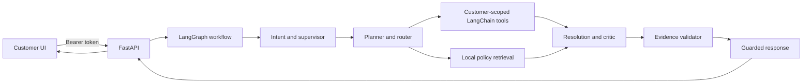

# System architecture

## Implemented request path

The Next.js client calls FastAPI using a bearer token. FastAPI validates the signed token, creates a workflow input with the authenticated subject, and invokes the compiled LangGraph workflow. LangChain tools are the only route to demo order and delivery records. Policy text is read from the local knowledge base and passed to the resolution and validation stages.

## Current implementation boundary

This is a local runnable reference, not a production deployment. Orders and tracking are seeded in process memory; conversations, tickets, audits, and workflow checkpoints are not persisted. Request telemetry is written to `database/observability.db` in SQLite WAL mode. Request IDs correlate API logs, traces, and HTTP/LangGraph spans. Overview metrics are SQL aggregates over measured requests. Telemetry APIs are development-only until observer-role authentication is implemented. PostgreSQL/pgvector and Redis run in Compose as infrastructure targets but are not yet connected to the workflow. Refund, cancellation, and replacement mutations are intentionally unavailable. The local retrieval implementation is lexical and does not claim semantic retrieval or embedding quality.